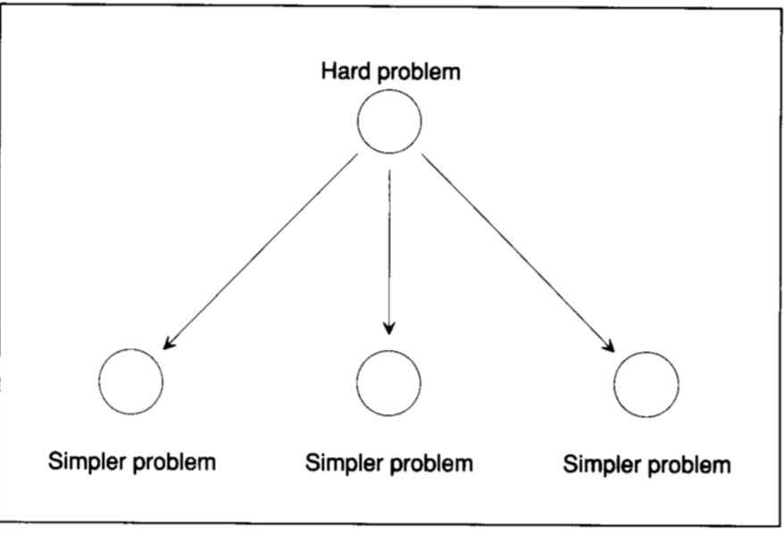
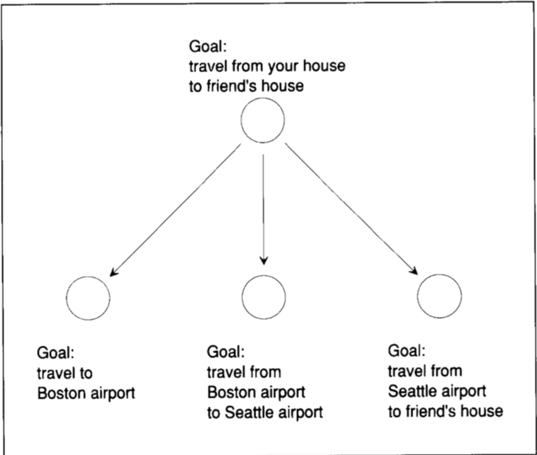

# Lecture 2: Reasoning: Goal Trees and Problem Solving

[James R. Slagle](https://www.openphilanthropy.org/files/Focus_Areas/AI/Chess_Programming_Wiki_James_R._Slagle.pdf) 

> Student and Ph.D. candidate at MIT, supervised by Marvin Minsky
> in 1961, he wrote his dissertation entitled Heuristic Program that Solves
> Symbolic Integration Problems in Freshman Calculus, Symbolic Automatic
> Integrator (Saint) , which is acknowledged as first Expert system . 

这一节课，教授通过使用一个积分计算从头串到尾巴，讲解了 James Slagle 的积分计算程序的原理（据说已经被集成到Matlab)。

首先，在解决一个复杂问题的时候，我们应该将其分解成相对简单的问题。

那么对应到积分问题，我们怎么把一个复杂的积分问题，转化为相对简单的子问题，我们可能会先观察该积分的特点，是否可以先分解成多个简单的子积分问题，比如提取常数，分解，化成多个积分之积，尝试使用三角代换等等。

那么其实，James Slagle 的积分求解方式就是把一个积分问题，进行分解，抓换，最后变成一个简单预先已经定义好的问题，然后进行求解。

1. 积分表 26 种
2. 安全变换 12 种
3. 启发式变换 12 种

积分表指的是，在这个表里，告诉你一些最基本的积分如何计算，比如 `积分 y = 1/2 * y^2 + C`。

安全变换，则是比如负号提取，提出常数，积分之和等于和之积分等等。

启发式变换，是指你无法确定你进行积分转化之后能否计算出结果，是一个不确定的结果，比如三角变换，你无法确定你进行转化之后能否计算出来。

### Goal Trees

Goal Trees，我感觉其实就是一棵树，然后进行广度搜索，搜寻出一条合适的问题解决路径。
当然，上面这棵树只是一棵很简单的树。如果是积分计算的话，尤其是复杂复合积分，需要进行多次转化的积分，显然，这棵树的深度和广度都会爆炸性增长。不过根据教授说的，正常学生解决的积分问题大都在三次转化以内，数学教授可以解决五次左右的转化，但是这个计算机可以解决11次转化。不过这个程序是很早以前的程序(32kb memory)，以目前的计算机算力来说，只要这个积分最后可以化成 n 个简单问题，不管经过几次转化（人类目前能想到的），应该都是比较容易就能计算出来的。

