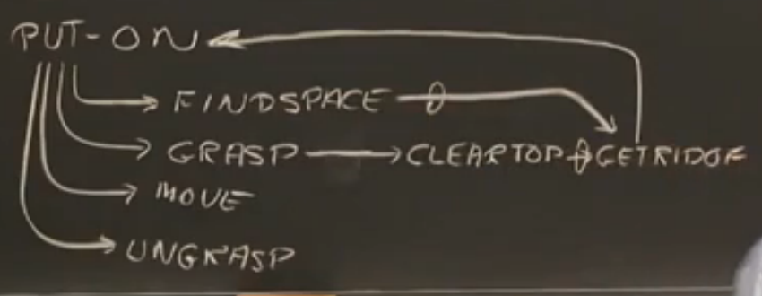
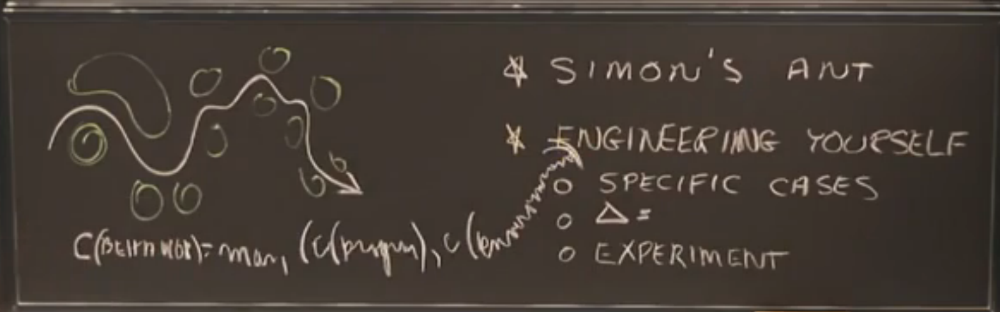

# Lecture 3: Reasoning: Goal Trees and Rule-Based expert systems

## 例子1

教授讲了一个搬砖块的例子，有点类似汉诺塔的那种游戏，把 A 砖块 从 XX 位置搬到 YY 位置，为了达到这个目的，你需要做到以下几点：

* Find space,寻找空间
* Grasp，抓取
* Move,  移动
* Ungrasp, 放下 

同时，你为了，清理空间，你需要对这个空间有阻碍的东西进行处理；为了抓取块 A， 你需要清理块 A 上面的空间，然后处理，处理空间时有可能又需要重复的回到搬砖的问题。例子 1 是一个比较抽象的例子，我来看下例子 2， 一个很具体的情况。

## 例子2

想要把块 B1 移动到 B2 位置。

* (1) 抓取块 B1
* (2) 清理块 B1 上面的空间
* (3) 处理块 BX
* (4) 把 BX 放到桌子上
* .....一切又回到了初始的位置，抓取某个块

如果你问他为什么要 `(3)处理块Bx`？ 它会回答，因为需要清理 `(2) 清理块 B1 上面的空间`;

如果你问他怎么样 `(2) 清理块 B1 上面的空间`？ 它会回答， `(3)处理块Bx`。

这是一个向上回答为什么，向下回答怎么做的问题。这其实就是一棵目标树，目标是 `PUTON B1 B2`，同时把树的分支都补全就是，一个`基于规则的"专家"系统`，规则是人定的。

注：p53-60有一个详细的例子

## 例子3

这里讲的是 `Simon's Ant` 的例子，

如果单独看沙滩上 🐜 的行走路线，会感觉到巨复杂，但是如果把 🐜 的行走路线和它周围的环境相结合再进行分析，会发现蚂蚁只不过是在行进中的每一步都避开小沙丘而已。

从而，引出了，一个巨复杂的问题，可以分解成各种简单的小问题，编程不难，难就难在如何理解业务，如何拆分业务，将复杂的业务逻辑拆解成一个个小的业务逻辑。

## 例子4
这里用了一个如何判断出一只豹子的目标树，你需要的规则，可能有

* 跑得快
* 有毛
* 斑点
* .... 等等

## Forward-chain 和 Backward-chain
Forward-chain:

> You can think of the forward chaining process as that of filtering a (finite) set of rules to find the one that is
applicable, then firing the rule, i.e., carrying out that rule's consequent, to change the state of the world. The state of
the world is represented as a set of database assertions (DB), which are statements about what is true in the world.
You might want to think about how ‘deeply’ the rules actually encode the state of knowledge about a particular
situation, for example, the grocery bagging rules. 

Backward-chain:
> For this class we will always assume that our backward chainers are trying to prove the truth of a conclusion, also
called a goal or hypothesis. In the process, they construct a so-called AND-OR goal-tree.
