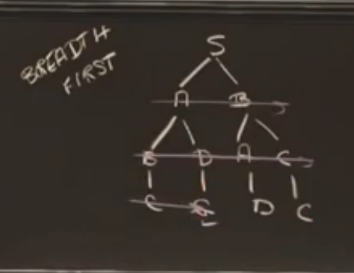

# Search

## 1. British Museum Algorithm
> The British Museum algorithm is a general approach to find a solution by checking all possibilities one by one, beginning with the smallest. 

大英博物馆的算法就是列出所有可能的解决路径，然后选择最小的那条。比如上图左侧，先列出所有可能的结果。

## 2. Depth First Search

> **Depth-first search (DFS)** is an algorithm for traversing or searching tree or graph data structures. The algorithm starts at the root node (selecting some arbitrary node as the root node in the case of a graph) and explores as far as possible along each branch before backtracking.

深度优先搜索，对于可能存在的路径，往树更深的地方一直查找，直到找到结果，找不到就退回来原来的分支节点，再继续寻找。不多说了，有计算机基础的都了解。不了解的可以看下维基。

## 3. Breadth First Search

>Best-first search is a search algorithm which explores a graph by expanding the most promising node chosen according to a specified rule.

广度优先搜索，顾明思议，就是先查找每一层的元素，而不是往更深一层的元素去查找。广度优先搜索有一个致命的缺点是，对于同一个节点，有可能被搜索多次（对于某个节点，从不同路径出发，它的深度是不一样的），所以一个可以优化的方法是，在队列扩展节点的时候，要先判断这个节点是否已经被扩展过了，如果被扩展过了，就放弃。

## 4. Hill climbing
> In numerical analysis, hill climbing is a mathematical optimization technique which belongs to the family of local search. It is an iterative algorithm that starts with an arbitrary solution to a problem, then attempts to find a better solution by making an incremental change to the solution. If the change produces a better solution, another incremental change is made to the new solution, and so on until no further improvements can be found.

这个定义看着有点头疼，简单来说，爬山算法是深度有点搜索的优化，为什么可以优化呢？因为爬山算法，它有一个队列，存着你还需要继续探索的路径的可能方案，然后用一个指标进行衡量之后，对这些方案进行排序，然后选择一个最好的方案先继续搜索。不过在连续空间中，爬山算法可能只能得到局部最优，或者在高维空间下止步不前。

举个例子

寻找 `S` 到 `D` 的路径，在 step 3， 通常程序会先按照 `S->A->C` 继续往下搜索，但是排序之后，程序会先按照 `S->A->D` 进行搜索。

## 5. Beam Search
> In computer science, beam search is a heuristic search algorithm that explores a graph by expanding the most promising node in a limited set. Beam search is an optimization of best-first search that reduces its memory requirements. Best-first search is a graph search which orders all partial solutions (states) according to some heuristic. But in beam search, only a predetermined number of best partial solutions are kept as candidates.[1] It is thus a greedy algorithm.

这个算法是对广度优先搜索的一个优化，不过对于下一层的扩展，始终只保持固定数量，比如一个二叉树，到第四层的时候，有 `8` 个节点，但对于束搜索，如果我们把 `Beam width` 设置为 `2`， 那么即使到第四层，依然只有 `2` 个节点，每次都只选择最好的那几个节点。

## 6. Best First Search
这种算法，个人觉得有点类似 `Beam Search`, 只是对 `Beam width` 没有限制，每次都先选择某一层中最好的节点来进行搜索。

## Reference

[British Museum algorithm](https://en.wikipedia.org/wiki/British_Museum_algorithm)
[Depth-first search](https://en.wikipedia.org/wiki/Depth-first_search)
[Best-first search](https://en.wikipedia.org/wiki/Best-first_search)