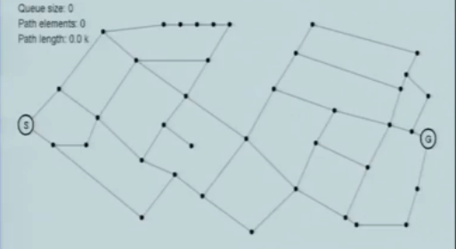
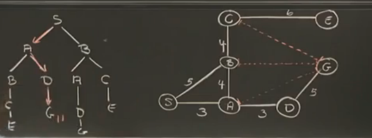
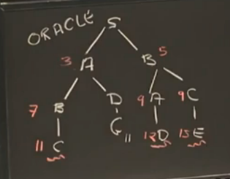
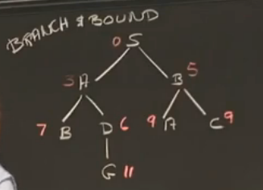
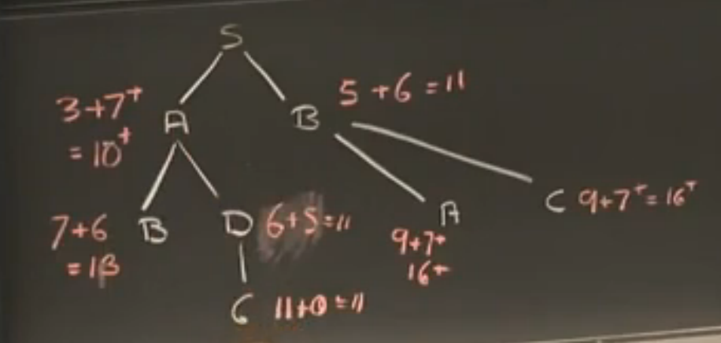
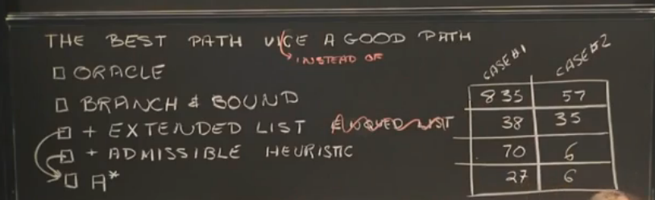
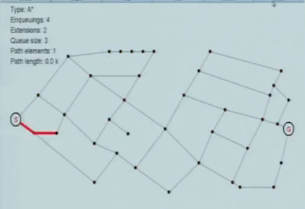
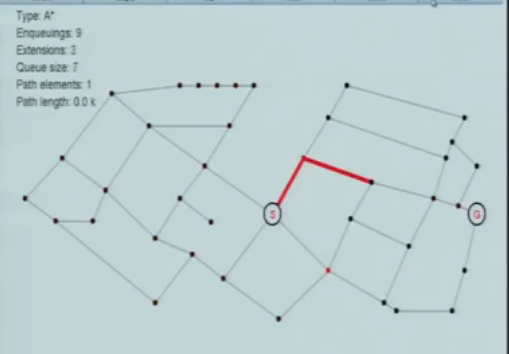
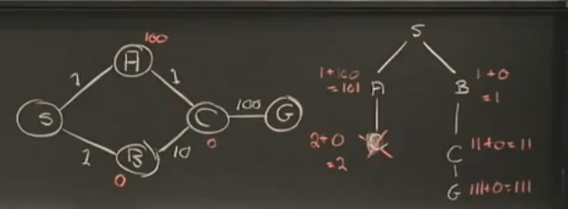

#Search: optimal, branch and bound, A*

## Optimal

人的肉眼能很容易找到一条从 S -> G 的一个较好的方案，但很可能不是最好的方案。

例子

注：红色线表示距离，但是不通。

上图中，从 S -> G 的最短距离是 `11`，现在如何检验这个答案是对的呢？

我们每次都扩展到目前为止累计距离最短的节点，同时如果扩展的节点累计距离已经超过给出的答案，就不再继续扩展。

上图的扩展顺序

* S->A, S->B
* S->A->B, S->A->D, S->B
* S->A->B, S->A->D, S->B->A, S->B->C
* S->A->D->G(这个不用管它，因为是要验证这条路径最短)，S->A->B->C(超过11，不用继续扩展往下)
* S->B->A->D, S->B->C->E, 都超过，不用继续往下扩展，因此 S->A->D->G 是最短路径

但，如果事先不知道最短距离是多长，该怎么办？

## branch and bound

一直按照最短累计距离往下扩展，直到找到目标节点。

看下图

按照最短路径扩展，找到了 `S->A->D->G` 累计路径长度是 `11`， 当然，这个时候还不能退出，因为不清楚其它节点的扩展结果是否会比 `11` 小。
此时有两种情况，一种是已经扩展的节点累计距离已经超过 `11`，则无需继续扩展，
一种是如果已经扩展的节点比`11`小，就继续扩展，直到比 `11` 大或者找到 `G`, 就无需继续往下扩展。

针对情况2，看下图

针对情况1，
假设上图节点的 `C`，累积距离已经达到 12，也无需继续扩展。

所以说起来，Branch and Bound 只是一种剪枝策略。但这种策略会很啥，它几乎需要找遍所有分支（即大英博物馆搜寻算法）。

### 扩展列表
同时，对于上图，也能看到，对于同一个节点，有可能被扩展多次，比如左边的 `B` 和右边的 `B`，所以可以通过维护扩展列表，去掉不必要的扩展（这里可能有一个疑问，如何确定先被扩展到的累计路径就比较短呢？ 比如 `S->A-B` 后于 `S->B` 扩展， `S->A-B` 一定会比 `S->B` 长吗？确定，因为我们总是先扩展最短的路径，假设 `S->A->B` 累计路径是 `4`， `S->B` 就不会被扩展出来）。一旦我们发现一条路径不可能成为最短路径，马上放弃它，这就是死马原则，Dead Horse Principle。

加上扩展列表之后会有一个比较好的性能提高。

对于扩展列表，只是确保它不在相同节点重复扩展，但有一点很重要的是，不能确保它不往反方向寻找终点，因为它不知道终点离它越来越远

### Admissible heuristic

现在我们不使用扩展队列，我们使用已经搜索到的节点的`累计距离`加上`当前节点到目标节点的预估距离`(启发式距离，会小于或者等于实际距离)来当做总距离。（其实我这里有一个疑问，这个启发式距离是如何给出的）

扩展列表 和 Admissible heuristic 哪种更好，取决于问题本身。是一端到一端还是中间到一端。

## A*

A* = branch and bound + extended list + admissible heuristic

case1:

case2:

A * 算法的工作流 

admissible heuristic 除非是在地图之下，不然可能会出现问题，因为预估距离可能会出现问题，我们看一下下面这张图，红色的数字是预估距离

由于预估距离的原因，我们会首先扩展 S->B->C，当我再尝试验证 S->A->C 的时候会直接丢掉 C，因为C已经被搜索过了。但实际上 S->B->C 不是最佳路径。

### 加强启发式距离使其适用于各种场景

#### Amissible heuristic
H(X,G) <= D(X,G) ，任意满足预计值小于 X 与 G 之间的实际距离，都是可容性的。

#### CONSISTENCY heuristic(stroner amissible)
abs( H(X,G) - H(Y,G) ) < D(X, Y)  

以上图中的，A,B节点为例子

abs( 100 - 0 ) !< 2，不满足一致性❌