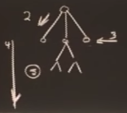

#Lecture 6: Search: Games, Minimax, and Alpha-Beta

## Games

教授这里举了下国际象棋的例子，各种下象棋的方式

1. 像人那样想各种策略然后移动旗子，不现实
2. if-then 规则
3. 把下一步可能的所有情况都列出来（分支），选择一种最优的
4. 大英博物馆策略，把以后所有可能的策略都列出来，算力不足
5. 尽可能的往下想可能出现的分支情况

如下图所示

## MiniMax
最大最小规则，可以理解成正反方，比如奇数层是正方，想尽可能的选择大的分支，偶数层是反方，想尽可能选择小的分支。那么往下探索 n（假设n是奇数） 层之后，有 2^n 个叶子节点，相当于代表棋盘上的每一种情况，然后给它赋值。那么倒数第二层反方就会想要选择最小值，倒数第三层正方想选择最大值，这样就可以一直往回推，直到第一层，下图告诉正方，应该选择左分支。

越往深入层搜索，胜利的概率越高，但算力并非无限，且叶子节点是指数级增加的。

## Alpha-Beta
其实 Alpha-Beta 只是 MiniMax 的一种优化做法，进行了一定情况下的剪枝。

上上面的图中可以发现，根节点的左侧数值小于 2，而右侧数值小于 1，显然根节点应该选择左侧，因此，右侧可以做一个剪枝。

看一个比较复杂的例子（直观上感觉剪枝效果不明显呐，然而实际上剪枝效果是明显的，以前需要检查的点是 b^d，而现在是 2b^(d)）

那假设要一个程序要往下探索 10 层，但是计算资源不允许时，怎么办？
可以先把计算出来的上一层结果记录起来，然后再接着往下算下一层，如果在计算下一层的中间，出现超时（给定一个计算时间），则用已经记录的上一层次优结果作为答案给出。

## Deep Blue
DEEP BLUE = MiniMax + Alpha-Beta + progressive deepening + parallel computing + an opening book + special-purpose stuff for the endgame + uneven tree development

