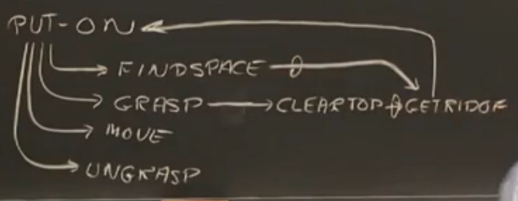
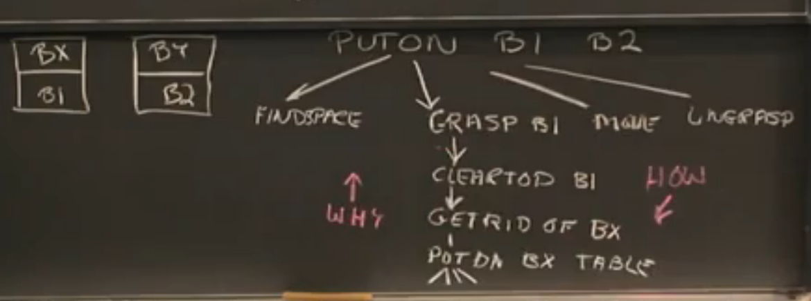
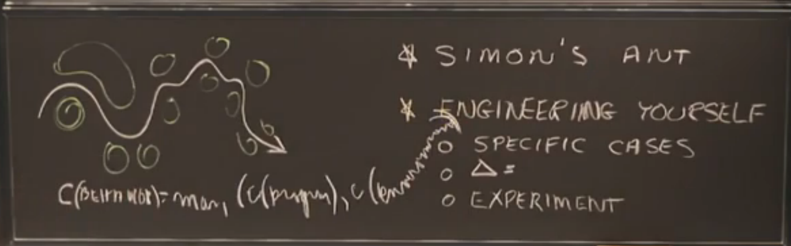

# Lecture 3: Reasoning: Goal Trees and Rule-Based expert systems

## 例子1

教授讲了一个搬砖块的例子，有点类似汉诺塔的那种游戏，把 A 砖块 从 XX 位置搬到 YY 位置，为了达到这个目的，你需要做到以下几点：

* Find space,寻找空间
* Grasp，抓取
* Move,  移动
* Ungrasp, 放下 

同时，你为了，清理空间，你需要对这个空间有阻碍的东西进行处理；为了抓取块 A， 你需要清理块 A 上面的空间，然后处理，处理空间时有可能又需要重复的回到搬砖的问题。例子 1 是一个比较抽象的例子，我来看下例子 2， 一个很具体的情况。

## 例子2

想要把块 B1 移动到 B2 位置。

* (1) 抓取块 B1
* (2) 清理块 B1 上面的空间
* (3) 处理块 BX
* (4) 把 BX 放到桌子上
* .....一切又回到了初始的位置，抓取某个块

如果你问他为什么要 `(3)处理块Bx`？ 它会回答，因为需要清理 `(2) 清理块 B1 上面的空间`;

如果你问他怎么样 `(2) 清理块 B1 上面的空间`？ 它会回答， `(3)处理块Bx`。

这是一个向上回答为什么，向下回答怎么做的问题。这其实就是一棵目标树，目标是 `PUTON B1 B2`，同时把树的分支都补全就是，一个`基于规则的"专家"系统`，规则是人定的。

注：p53-60有一个详细的例子

## 例子3

这里讲的是 `Simon's Ant` 的例子，

如果单独看沙滩上 🐜 的行走路线，会感觉到巨复杂，但是如果把 🐜 的行走路线和它周围的环境相结合再进行分析，会发现蚂蚁只不过是在行进中的每一步都避开小沙丘而已。

从而，引出了，一个巨复杂的问题，可以分解成各种简单的小问题，编程不难，难就难在如何理解业务，如何拆分业务，将复杂的业务逻辑拆解成一个个小的业务逻辑。

## 例子4
这里用了一个如何判断出一只豹子的目标树，你需要的规则，可能有

* 跑得快
* 有毛
* 斑点
* .... 等等

同时顺便解释了什么是 `Forward-chain` 和 `Backward-chain`