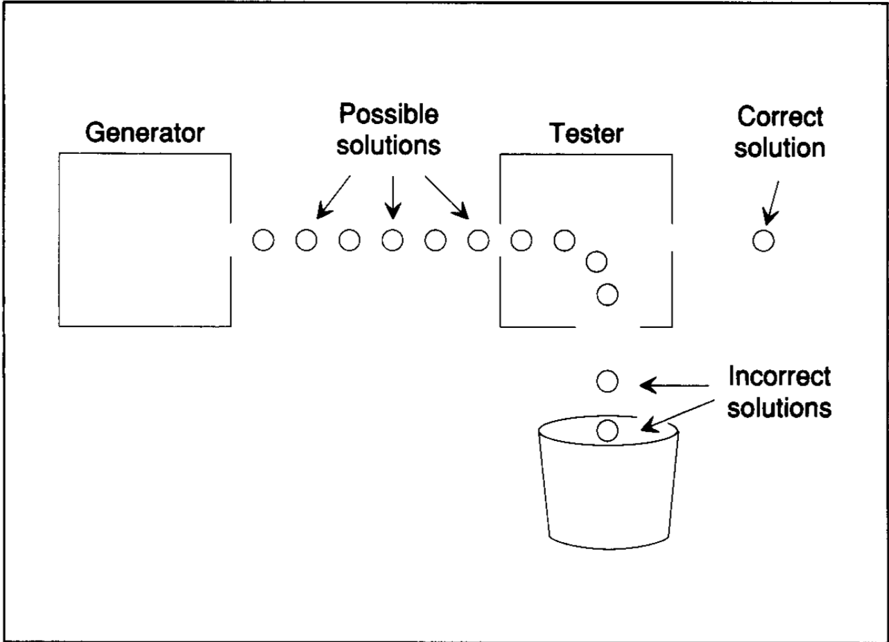

# Introduction and scope

### 1. What is Artifical Intelligence
> **Algorithms enable by constraints exposed by representation that support models targets at thinking, perception and action.**

1. 说到人工智能，首先应该想到它应该具备有思考，感知和行动的能力。

那么如何去支持机器拥有这些特点呢？

我们应该建立模型，使得这个模型具有思考，感知和行动的能力。

同时，模型应该是有限制条件的，它不可能是无限可能的。

那如何建立模型呢？

通过算法建立模型。

### 2. Rumpelstiltskin Principle
**Rumpelstiltskin Principle** says that once you can name something, you get power over it.

如果我们能叫出一个事物的名字，说明我们对该事物已经有或多或少的了解。

### 3. Generator and Tester
Once we have a good representation, we can try and find an acceptable solution.

测试生成器包括两个部分，生成器，生成可能的解决方案；测试器，检测生成的解决方案，接受或者拒绝。

### 4. 奇迹

> The miracle is that I have communicated with you through language and your language system commanded your visal system to execute a program that involves scaning across that line coming as you go, and then your vision system come back to your language system and said 6.

这里说的奇迹是，

1. 教授问，有几个非洲国家被赤道穿过？用生命保证回答的正确性。
2. 教授放了一张图
3. 教授再问一次，赤道穿过的非洲国家有几个？

### 5. 其它

* Representation Right == almost done
* Simple != Trivial
* Rumpelstiltskin Principle

当你能够用一个模型正确表达某个东西的时候，说明你的这个模型就已经基本完成了。

简单 != 没用， simple can be very powerful

模型不是越复杂越好，如果在相同情况下，模型越简单越好。

> Take two concepts and combine them to make a third concepts without disturbing the original 2 concepts.

 
##### Language has two functions:

1. To up. It enables us to make descriptions, enables us to tell stories. And story telling and story understanding is what all education is about.
2. To down. It enables us to marshal the resources of our perceptual systems and even command our perceptual system to image thing we've never seen.

语言有两大力量，一是，向上，给了我们讲故事和理解事物的能力，这也是教育的目的；二是，向下，让我们拥有协同身体的能力，甚至于使我们能够想象我们从来没见过的东西。

比如，想象一下一个人提着一桶沙子在马路上走路，你可以会想象他一瘸一拐的提着桶走着，即使你从来没见过这种场景。